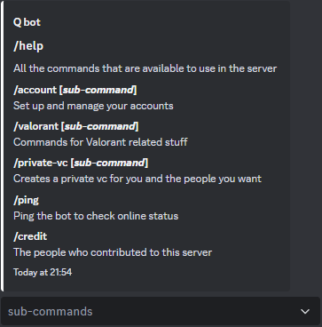
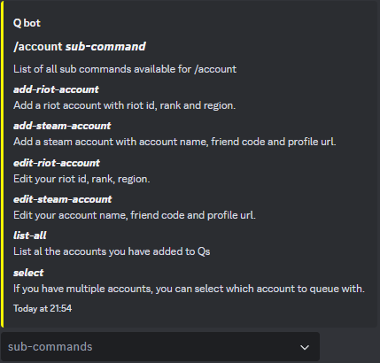
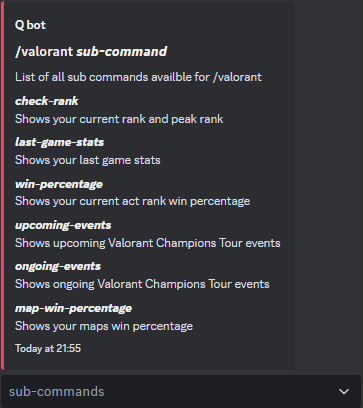
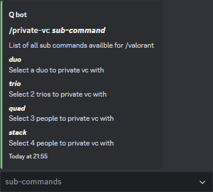

# Q-bot

## Join the server!

Invite Link: [Discord](https://discord.com/invite/cQBxJNeD3F)

## About

Q bot is a discord bot that allows you to check your Valorant stats,
manage Valorant accounts you've added, create private voice channels in the server, and more.

## Commands

| Commands                   | Actions                                          |
| -------------------------- | ------------------------------------------------ |
| `/help`                    | List all availble commands                       |
| `/coin-flip`               | Flip a coin                                      |
| `/ping`                    | Ping to check bot's online status                |
| `/credit`                  | Shoutout to the people that contributed          |
| `/account [sub-command]`   | Manage accounts added to Q bot                   |
| `/valorant [sub-command]`  | Check Valorant stats and VCT related info        |
| `private-vc [sub-command]` | Create private voice channel (only in Qs server) |

### Sub Commands

| Commands      | Sub Commands         | Options                             | Actions                                                          |
| ------------- | -------------------- | ----------------------------------- | ---------------------------------------------------------------- |
| `/account`    | `select`             | /                                   | Select one of your accounts                                      |
| `/account`    | `list-all`           | /                                   | List all accounts added to Q bot                                 |
| `/account`    | `add-riot-account`   | /                                   | Add riot account with riot id, rank and region                   |
| `/account`    | `add-steam-account`  | /                                   | Add steam account with account name, friend code and profile url |
| `/account`    | `edit-riot-account`  | /                                   | Edit riot id, rank and region                                    |
| `/account`    | `edit-steam-account` | /                                   | Edit account name, friend code and profile url                   |
| `/valorant`   | `check-rank`         | `player`                            | Get current rank and peak rank of a player                       |
| `/valorant`   | `last-game-stats`    | `player`                            | Get stats from last game of a player                             |
| `/valorant`   | `win-percentage`     | `player`                            | Get total wins, loses and win percentage                         |
| `/valorant`   | `map-win-percentage` | `player`                            | Get map win percentage of each map                               |
| `/valorant`   | `upcoming-events`    | /                                   | Get upcoming Valorant Champions Tour events                      |
| `/valorant`   | `ongoing-events`     | /                                   | Get ongoing Valorant Champions Tour events                       |
| `/private-vc` | `duo` (only in Qs)   | `duo`                               | Get in a private voice channel with a duo                        |
| `/private-vc` | `trio` (only in Qs)  | `trio1` `trio2`                     | Get in a private voice channel with 2 other players              |
| `/private-vc` | `quad` (only in Qs)  | `quad1` `quad2` `quad3`             | Get in a private voice channel with 3 other players              |
| `/private-vc` | `stack` (only in Qs) | `stack1` `stack2` `stack3` `stack4` | Get in a private voice channel with 2 other players              |

#### Screenshots

| /help                                                    | /help (account)                                              |
| -------------------------------------------------------- | ------------------------------------------------------------ |
|                    |        |
| /help (valorant)                                         | /help (private-vc)                                           |
|  |  |

### Mod Commands

| Commands | Sub Commands    | Options                         | Actions                               |
| -------- | --------------- | ------------------------------- | ------------------------------------- |
| `/setup` | /               | /                               | Add all ncessary roles for Qs server  |
| `/mod`   | `clear-queue`   | /                               | Clear all players in queue            |
| `/mod`   | `clear-channel` | `clear-channel`                 | Delete all messages in channel        |
| `/mod`   | `annoucement`   | `message` `annoucement channel` | Send annoucement message to a channel |

## Instructions

- enable server members intent
- enable message content intent

- `npm init`
- `npm i axios cheerio discord.js dotenv puppeteer puppeteer-extra puppeteer-extra-plugin-stealth`

- setup .env file

website help:

- https://discordjs.guide

- https://discord.js.org
