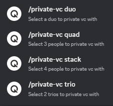

# Q-bot

## Join the server!

Invite Link: [Discord](https://discord.com/invite/cQBxJNeD3F)

## Features

This is a discord bot used for queuing duo, trio, 5 stack, 1v1 and 10 mans.

## Commands

### `/setup`

Adds all the necessary roles for the server.

### `/help`

| /help                                                    | /help (account)                                              |
| -------------------------------------------------------- | ------------------------------------------------------------ |
|                    |        |
| /help (valorant)                                         | /help (private-vc)                                           |
|  |  |

List all the commands that are available for discord members.

### `/ping`

Command used to see if the bot is online.

### `/player-profile [region] [rank] [riot-id]`

Command for setting up their own profile. [region, rank, riot id]

### Commands for private vc

- `/duo [duo]`

- `/trio [trio1] [trio2]`

- `/quad [quad1] [quad2] [quad3]`

- `/stack [stack1] [stack2] [stack3] [stack4] `

### `/mod-help`

List all the moderation command for mods.

### `/mod`

#### `/mod clear-channel [channel(optional)]`

Clears all the messages in the channel.

#### `/mod announcement [announcement-channel] [message]`

Make an announcement message in a channel.

#### `/mod delete-all-queue`

Deletes all the queue in data.json.

### `/valorant`

#### `/valorant check-rank [player(optional)]`

#### `/valorant win-percentage [player(optional)]`

#### `/valorant last-game-stats [player(optional)]`

#### `/valorant match-history [player(optional)]`

#### `/valorant map-win-percentage [player(optional)]`

#### `/valorant ongoing-events`

#### `/valorant upcoming-events`

valorant related commands

---

- /ping

- /setup

- /player-profile

private vc

- /duo

- /trio

- /quad

- /stack

## Instructions

- enable server members intent

- enable message content intent

- `npm init`

- `npm i axios cheerio discord.js dotenv puppeteer puppeteer-extra puppeteer-extra-plugin-stealth`

- setup .env file

website help:

- https://discordjs.guide

- https://discord.js.org
